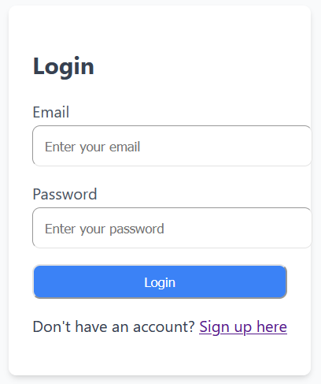
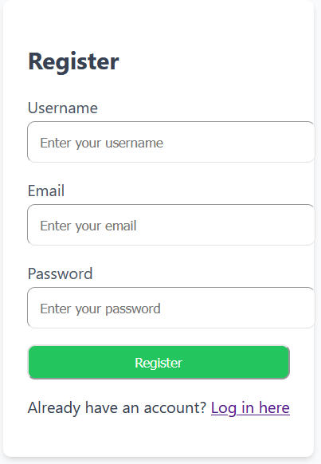
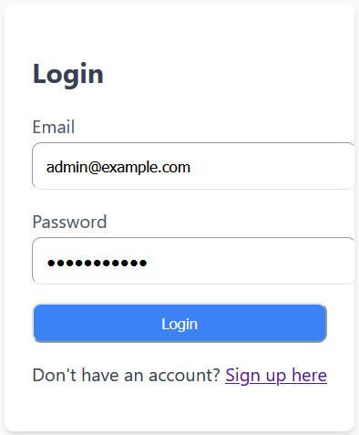
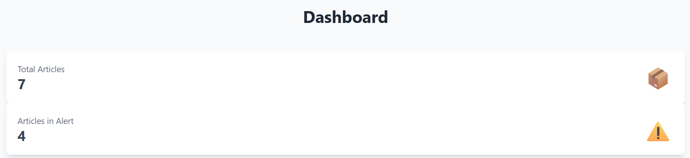
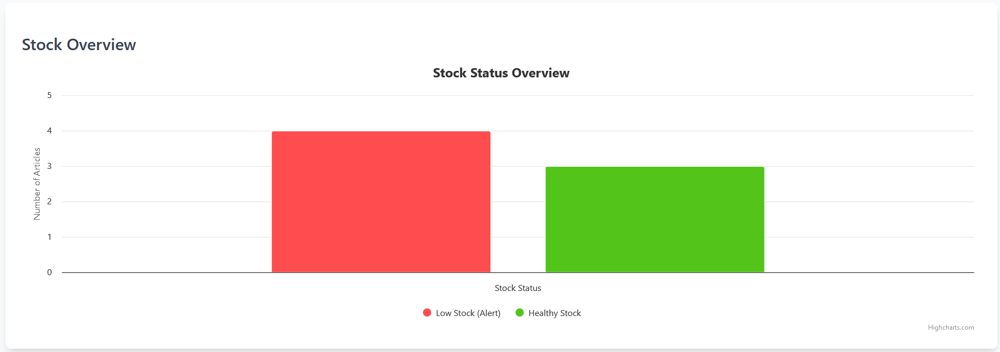
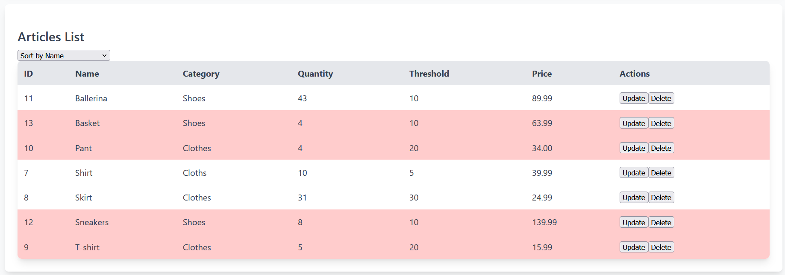
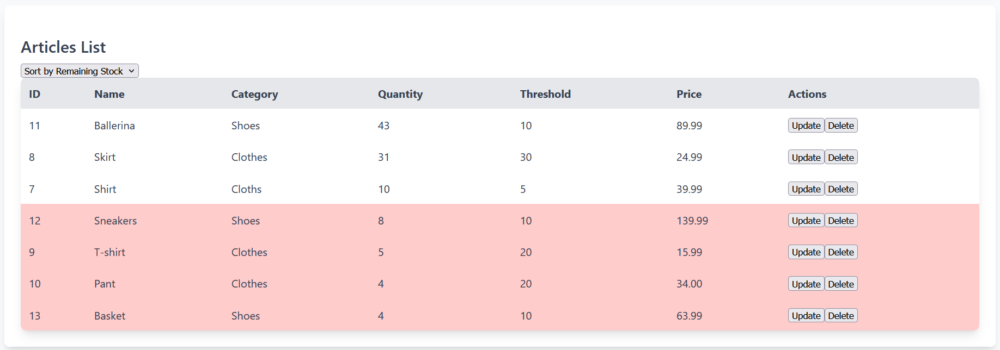
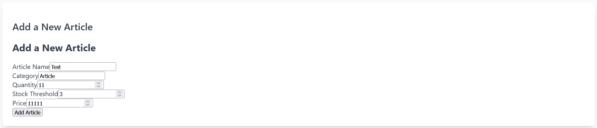
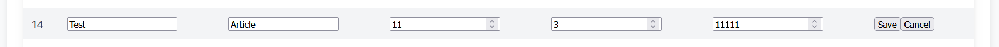
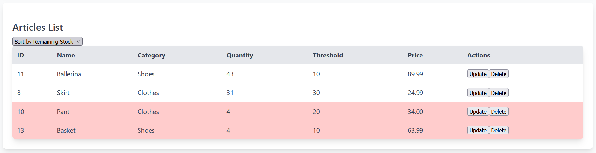

# NR_SE
Node &amp; React and Software Engineering project

Maiaroca = Maïa

Ficus22 = Esteban (he doesn't have node)

Pierre = PiAirCarre

Rayanekerr = Rayane KERROUCHE XD

## Web page overview :
First we have the login page.

If it is your first time, you can create your account by clicking on Sign up here.

When you have created your account you can now go back on the login page.

After logging in, you can see the Dashboard.

Here you can already see how many articles need to be refilled.
If you go down you have also a histogram to illustrate.

And at the bottom of the page there is the article list.

There are different observations about the articles, including the quantity and the threshold.
If the quantity fall under the threshold, the line become red and the article switch to alert.
You can sort the line by name, category or quantity.

Finally, you can create new articles.

You can update it.

ANd you can delete it (for the example I kept only 4 articles and delete the rest).

### Key word of the project : 
Inventory Management System (IMS)
Small Business
Node.js
React
CRUD (Create, Read, Update, Delete)
Real-Time Tracking
Low Stock Alerts
Reporting
User-Friendly Interface
Data Privacy
Security
Scalability
Usability
Cloud Platform
Stock Level Monitoring
Inventory CRUD
Notification Systems
Data Export
Graphical and Tabular Reports
System Uptime
Internet Access
Compatibility
